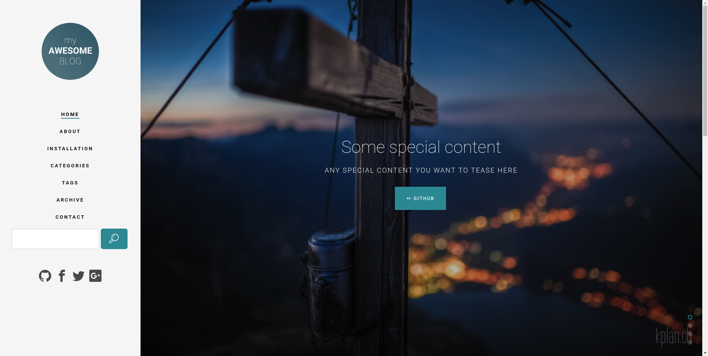
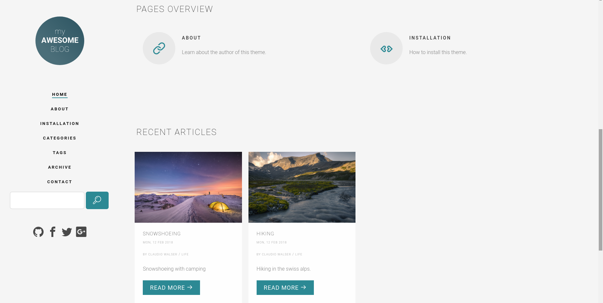
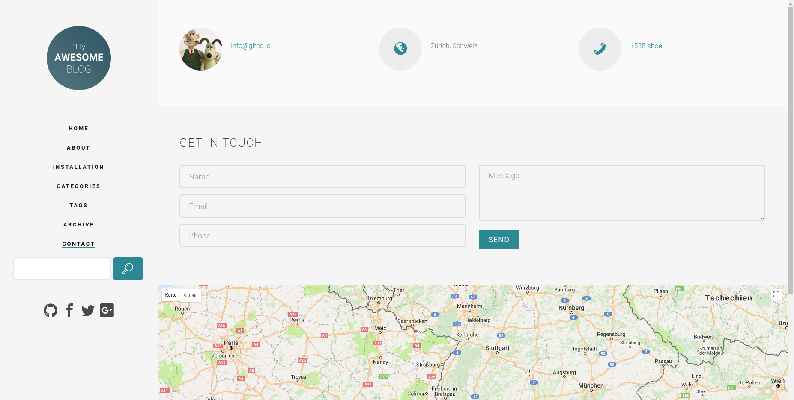

Description
-----------

**pelican-fh5co-marble** is a layout from https://freehtml5.co/ ported to pelican.

Features
--------

- Fully responsive
- Translation support
- Working contact form (sending is done in php)
- Integrated tipue_search Plugin
- Google Maps integration
- Disqus integration

Todo's for later version
------------------------

- ADs
- Google Analytics
- Facebook/Twitter share

Plugins
-------
- https://github.com/getpelican/pelican-plugins/tree/master/i18n_subsites
- https://github.com/getpelican/pelican-plugins/tree/master/tipue_search

Example blog
------------

You can find a fully working example under https://github.com/claudio-walser/pelican-fh5co-marble-example

.. code:: console

    git clone https://github.com/claudio-walser/pelican-fh5co-marble.git
    git clone https://github.com/claudio-walser/pelican-fh5co-marble-example.git
    cd pelican-fh5co-marble-example
    pelican
    ./develop_server.sh start 8081

Then visit http://localhost:8081 with your browser.

Contact Form
------------

To get the contact form working, you need to change SMTP Login values in output/theme/mail-config.php
For security reasons, NEVER check in this file anywhere but replace values in the output folder of your Pelican Blog manually or by script.
Personally I build my pelican sites using jenkins and there i have a build step which is replacing SMTP Login values after the pelican build.

.. code:: php

    <?php

    define('SMTP_SERVER', 'mail.your-domain.com');
    define('SMTP_PORT', 587); # usually, only smtp over tls is supported
    define('SMTP_REALNAME', 'John Doe');
    define('SMTP_USER', 'john.doe@your-domain.com');
    define('SMTP_PASS', 'secret');

    define('RECEIPIENT', 'john.doe@your-domain.com');
    define('RECEIPIENT_REALNAME', 'John Doe');

    ?>

Credits
-------
- Layout by https://freehtml5.co/
- Example Images by David Kaplan http://www.kplan.ch/
- And thanks to Alexandre Vicenzi, creator of the great Flex theme for many impressions and how to's https://github.com/alexandrevicenzi/Flex

Translations
------------

Pull Request with more translations are very welcome.
Languages in the theme right now

- English
- German
- French (done with google translate)
- Spanish (done with google translate)

To create a new language, execute translations.sh

.. code:: console

    ./translations.sh new ru_RU

Then translate the strings in ./locale/ru_RU/LC_MESSAGES/messages.po
Afterwards call translations.sh with compile

.. code:: console
    
    ./translations.sh compile

Again, thanks to Alexandre Vicenzi because I copied his script.

Issues or feature-requests
--------------------------

If you discover any bugs, feel free to create an issue on GitHub or fork
and send me a pull request.

`Issues List`_.

Authors
-------

-  Claudio Walser (https://github.com/claudio-walser)

License
-------

https://creativecommons.org/licenses/by/3.0/

.. _Issues List: https://github.com/claudio-walser/pelican-fh5co-marble/issues

Screenshots
-----------

